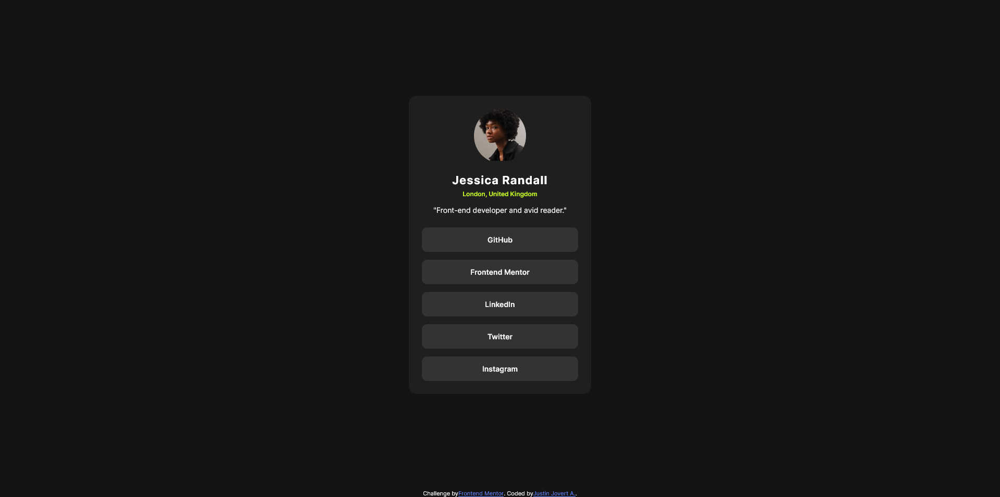

# Frontend Mentor - Social links profile solution

This is a solution to the [Social links profile challenge on Frontend Mentor](https://www.frontendmentor.io/challenges/social-links-profile-UG32l9m6dQ). Frontend Mentor challenges help you improve your coding skills by building realistic projects. 

## Table of contents

- [Overview](#overview)
  - [The challenge](#the-challenge)
  - [Screenshot](#screenshot)
  - [Links](#links)
- [My process](#my-process)
  - [Built with](#built-with)
  - [Continued development](#continued-development)
  - [Useful resources](#useful-resources)
- [Author](#author)
- [Acknowledgments](#acknowledgments)

**Note: Delete this note and update the table of contents based on what sections you keep.**

## Overview

A simple social link profile!

### The challenge

Users should be able to:

- See hover and focus states for all interactive elements on the page

### Screenshot

### Links

- Live Site URL: [Github](https://justinjovert.github.io/Social-links-profile)

## My process

 A container for the whole content and have its direction set to column and adjust each element's padding and margin.

 Used anchor tag instead of button, more simpler that way!

### Built with

- Semantic HTML5 markup
- CSS custom properties
- Flexbox

### Continued development

Continue to do challenges to solidify skills.

### Useful resources

- [Asaeneh's 30 Day of JavaScript](https://github.com/Asabeneh/30-Days-Of-JavaScript)

## Author

- [Github](https://github.com/Justinjovert/)
- Frontend Mentor - [Justinjovert](https://www.frontendmentor.io/profile/Justinjovert)

## Acknowledgments

Frontend Mentor and Asabeneh Yetayeh.